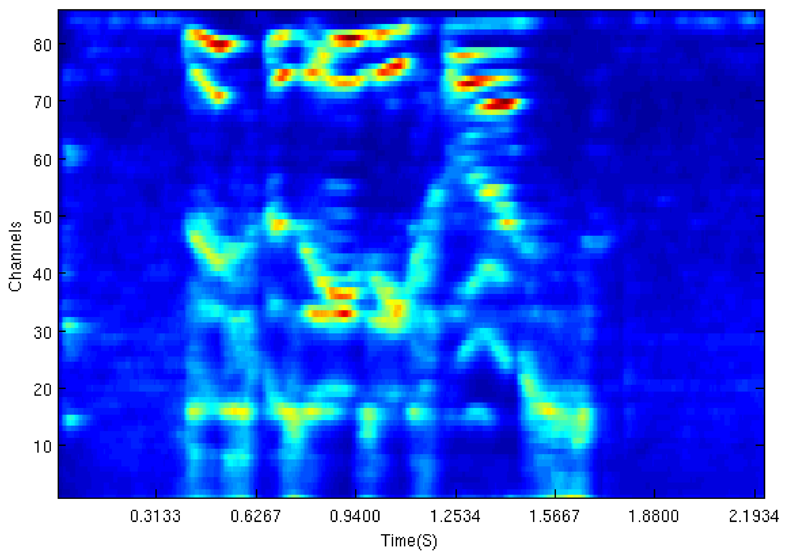
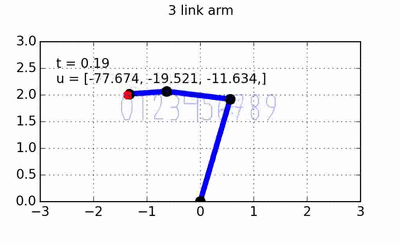
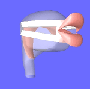

### Knowledge Representation   with the Semantic Pointer Architecture:

### Nengo Summer School 2014

Eric Crawford  
Centre for Theoretical Neuroscience  

---Right---

Our formalization of knowledge:
Semantic Networks

WordNet

Graph-like stucture.
Node are concepts, edges are relations between concepts.

Edges are labelled with type of relation:
is a kind of, is an instance of, is a part of, is a member of,
is a substance of

---Right---

Goal: encode an arbitrary semantic network in a network of spiking neurons.

Getting more specific:

<ol>
<li>Establish a vector encoding of the semantic network. Assignment of vectors to each concept and each relation type.</li>
<li>Create a neural network that can "traverse" the semantic network.</li>
</ol>

---Right---

In other words, we want to fill in the blanks in the following network:

---Right---
Encoding relational structure.

Edge-list representation of a graph. Can store this using role-filler
construction we have seen before with semantic pointers.

  $\mathbf{dog} = \mathbf{isA} \circledast \mathbf{canine_{ID}} + \mathbf{partOf} \circledast \mathbf{pack_{ID}}$

---Right---

<small>
  <https://www.youtube.com/watch?v=uKKpjvPd6Xo>
  <!-- <https://www.youtube.com/watch?v=uF55KRuqPH8> -->
  <!-- <https://www.youtube.com/watch?v=ujmQlgNWZn4> -->
</small>

---Right---

<object type="image/svg+xml" data="img/synth.svg" width="700"></object>

  $$\underset{u}{\operatorname{argmin}} \:
   \overbrace{\sum\_{1,n} C(u\_n, t\_n)}^{\color{blue}{\text{Target cost}}} \:\:
   \overbrace{\sum\_{2,n} C(u\_{n-1}, u\_n)}^{\color{blue}{\text{Join cost}}}$$

<object type="image/svg+xml" data="img/synth-hmm.svg" width="500" class="fragment"></object>

---Right---

<iframe src="http://talktyper.com/" width="800" height="400"></iframe>

  Lots of data + lots of compute power

---Right---

### Goal

Train an

  articulatory synthesizer to repeat utterances. 

<object type="image/svg+xml" data="img/goal.svg" width="500"></object>

  <audio controls preload="auto">
    <source src="media/gnuspeech.wav" type="audio/wav">
  </audio>

---Right---

<object type="image/svg+xml" data="img/min.svg" width="860"></object>

---Right---

### Method

<object type="image/svg+xml" data="img/arm.svg" width="300"></object>

  \begin{eqnarray}
    \mathbf{x} \Rightarrow & \text{End-effector position}
        & \Rightarrow \text{Auditory features} \\\\
    \mathbf{q} \Rightarrow & \text{Joint coordinates}
        & \Rightarrow \text{Control parameters} \\\\
  \end{eqnarray}

 

  $\text{Control signal:} \quad
    (\mathbf{q}, \mathbf{\dot{q}}, \mathbf{\ddot{x}_d})
    \rightarrow \mathbf{u}$

---Right---

<object type="image/svg+xml" data="img/min-vars.svg" width="860"></object>

  $$\text{Evaluation: } E = \int d(\mathbf{x_d}, \mathbf{x})$$

---Right---

<object type="image/svg+xml" data="img/periphery-anatomy.svg" width="890"></object>

---Right---

<object type="image/svg+xml" data="img/zilany.svg" width="890"></object>

----

<small>A phenomenological model of the synapse between the inner hair
cell and auditory nerve: long-term adaptation with power-law
dynamics. Zilany, et al. *The Journal of the Acoustical Society
of America*, **126**:2390–2412, 2009.</small>

---Right---

----

<small> <http://www.cs.colostate.edu/~ericson/ericsonFinal.pdf>  A
  computational model of filtering, detection, and compression in the
  cochlea. R. F. Lyon. In *Proceedings of IEEE-ICASSP-82*,
  1282-1285, 1982.
</small>

---Right---

<object type="image/svg+xml" data="img/min-vars.svg" width="860"></object>

---Right---

<object type="image/svg+xml" data="img/birkholz.svg" width="890"></object>

----

<small>Modeling consonant-vowel coarticulation for articulatory speech
synthesis. Birkholz. *PloS one*, **8**(4):e60603, 2013.</small>

---Right---

  <video width="320" height="240" controls preload="auto">
    <source src="media/guten-tag.ogg" type="video/ogg">
  </video>

  <audio controls preload="auto">
    <source src="media/s1-neutral.wav" type="audio/wav">
  </audio>
  Normal

  <audio controls preload="auto">
    <source src="media/s1-anger.wav" type="audio/wav">
  </audio>
  Angry

  <audio controls preload="auto">
    <source src="media/s1-fear.wav" type="audio/wav">
  </audio>
  Scared

----

<small>
<http://www.vocaltractlab.de/index.php?page=vocaltractlab-examples>  
<http://www.vocaltractlab.de/index.php?page=birkholz-supplements>
</small>

---Right---

<video width="500" controls preload="auto">
  <source src="media/dona-nobis.ogg" type="video/ogg">
</video>

<video width="500" controls preload="auto">
  <source src="media/salvete.mp4" type="video/mp4">
</video>

----

<small>
<http://www.vocaltractlab.de/index.php?page=vocaltractlab-examples>  
<http://www.vocaltractlab.de/index.php?page=birkholz-supplements>
</small>

---Right---

<table id="birkholz-params" class="reveal">
  <tr>
    <th>Name</th>
    <th>Description</th>
    <th>Min.</th>
    <th>Max</th>
    <th>Unit</th>
  </tr>
  <tr>
    <td>$HX$</td>
    <td>Horizontal hyoid position</td>
    <td>0.0</td>
    <td>1.0</td>
    <td></td>
  </tr>
  <tr>
    <td>$HY$</td>
    <td>Vertical hyoid position</td>
    <td>-6.0</td>
    <td>-3.4</td>
    <td>cm</td>
  </tr>
  <tr>
    <td>$JX$</td>
    <td>Horizontal jaw displacement</td>
    <td>-0.5</td>
    <td>0.0</td>
    <td>cm</td>
  </tr>
  <tr>
    <td>$JA$</td>
    <td>Jaw angle</td>
    <td>-7.0</td>
    <td>0.0</td>
    <td>deg</td>
  </tr>
  <tr>
    <td>$LP$</td>
    <td>Lip protrusion</td>
    <td>-1.0</td>
    <td>1.0</td>
    <td></td>
  </tr>
  <tr>
    <td>$LD$</td>
    <td>Vertical lip distance</td>
    <td>-2.0</td>
    <td>4.0</td>
    <td>cm</td>
  </tr>
  <tr>
    <td>$VS$</td>
    <td>Velum shape</td>
    <td>0.0</td>
    <td>1.0</td>
    <td></td>
  </tr>
  <tr>
    <td>$VO$</td>
    <td>Velic opening</td>
    <td>-0.1</td>
    <td>1.0</td>
    <td></td>
  </tr>
  <tr>
    <td>$TCX$</td>
    <td>Tongue body center X</td>
    <td>-3.0</td>
    <td>4.0</td>
    <td>cm</td>
  </tr>
  <tr>
    <td>$TCY$</td>
    <td>Tongue body center Y</td>
    <td>-3.0</td>
    <td>1.0</td>
    <td>cm</td>
  </tr>
  <tr>
    <td>$TTX$</td>
    <td>Tongue tip X</td>
    <td>1.5</td>
    <td>5.5</td>
    <td>cm</td>
  </tr>
  <tr>
    <td>$TTY$</td>
    <td>Tongue tip Y</td>
    <td>-3.0</td>
    <td>2.5</td>
    <td>cm</td>
  </tr>
  <tr>
    <td>$TBX$</td>
    <td>Tongue blade X</td>
    <td>-3.0</td>
    <td>4.0</td>
    <td>cm</td>
  </tr>
  <tr>
    <td>$TBY$</td>
    <td>Tongue blade Y</td>
    <td>-3.0</td>
    <td>5.0</td>
    <td>cm</td>
  </tr>
  <tr>
    <td>$TRX$</td>
    <td>Tongue root X</td>
    <td>-4.0</td>
    <td>2.0</td>
    <td>cm</td>
  </tr>
  <tr>
    <td>$TRY$</td>
    <td>Tongue root Y</td>
    <td>-6.0</td>
    <td>0.0</td>
    <td>cm</td>
  </tr>
  <tr>
    <td>$TS1$</td>
    <td>Tongue side elevation 1</td>
    <td>-1.4</td>
    <td>1.4</td>
    <td>cm</td>
  </tr>
  <tr>
    <td>$TS2$</td>
    <td>Tongue side elevation 2</td>
    <td>-1.4</td>
    <td>1.4</td>
    <td>cm</td>
  </tr>
  <tr>
    <td>$TS3$</td>
    <td>Tongue side elevation 3</td>
    <td>-1.4</td>
    <td>1.4</td>
    <td>cm</td>
  </tr>
  <tr>
    <td>$TS4$</td>
    <td>Tongue side elevation 4</td>
    <td>-1.4</td>
    <td>1.4</td>
    <td>cm</td>
  </tr>
  <tr>
    <td>$MA1$</td>
    <td>Minimum area tongue back region</td>
    <td>0.0</td>
    <td>0.3</td>
    <td>cm$^2$</td>
  </tr>
  <tr>
    <td>$MA2$</td>
    <td>Minimum area tongue tip region</td>
    <td>0.0</td>
    <td>0.3</td>
    <td>cm$^2$</td>
  </tr>
  <tr>
    <td>$MA3$</td>
    <td>Minimum area lip region</td>
    <td>0.0</td>
    <td>0.3</td>
    <td>cm$^2$</td>
  </tr>
</table>

---Right---

<object type="image/svg+xml" data="img/min-vars.svg" width="860"></object>

---Right---

  
  

----

<small><http://studywolf.wordpress.com/></small>

---Right---

\begin{eqnarray}
 \min\_u C(\mathbf{u}) =& \mathbf{u^T N u} \quad
  \text{s.t. } \mathbf{J \ddot{q}}
  = \mathbf{\ddot{x}}\_\text{ref} - \mathbf{\dot{J} \dot{q}} \\\\
 \mathbf{\ddot{x}}\_\text{ref} =& \mathbf{\ddot{x}\_d} + \mathbf{K}\_d
  (\mathbf{\dot{x}}\_d - \mathbf{\dot{x}}) + \mathbf{K}\_p
  (\mathbf{x}\_d - \mathbf{x})
\end{eqnarray}

<object type="image/svg+xml" data="img/learn-osc.svg" width="600" class="fragment"></object>

----

<small> Learning to control in operational space.  Peters & Schaal.
*The International Journal of Robotics Research* **27**(2), 197-212,
2008 </small>

---Right---

### Extension 1

Generalize several utterances of the same category

<object type="image/svg+xml" data="img/goal-1.svg" width="500"></object>

  Evaluation: User studies
  

  <small>
    Learning movement primitives. Schaal et al. 
    *Robotics Research* 561-572, 2005. 
    Learning attractor landscapes for learning motor primitives. 
    Ijspeert et al. *NIPS 2003*: 1547-1554, 2003.
  </small>

---Right---

### Extension 2

Classify utterances corresponding
to different categories

<object type="image/svg+xml" data="img/goal-2.svg" width="500"></object>

  

  <small>
    Extensions of recurrent neural network language model. 
    Mikolov et al. In *ICASSP 2011*, 2011. 
    Learning recurrent neural networks with hessian-free optimization. 
    Martens & Sutskever. *ICML '11*, 2011.
  </small>

---Right---

<object type="image/svg+xml" data="img/goal.svg" width="500"></object>

 

<object type="image/svg+xml" data="img/min-vars.svg" width="860"></object>

---Right---

## Thank you

This presentation: <http://bekolay.org/comp2>

My progress: <http://github.com/tbekolay/audition>
